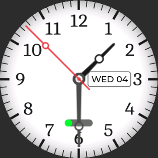
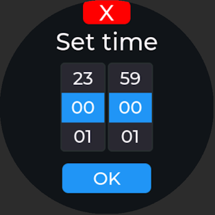
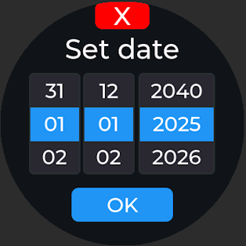

# FlatSphere Clock

<p align="center">
  <a href="https://youtube.com/shorts/csSeqjpLOCE">
    
  </a>
  <br/>
  <i>Click to watch the demo video</i>
</p>

<p align="center">
  <b>WaveShare LCD 1.85C Demo Project</b><br/>
  An ESP32-S3 powered smart clock with Text-to-Speech capabilities, RTC, battery monitoring, and more.
</p>

<p align="center">
  <a href="#features">Features</a> •
  <a href="#hardware">Hardware</a> •
  <a href="#getting-started">Getting Started</a> •
  <a href="#screenshots">Screenshots</a> •
  <a href="#license">License</a>
</p>

---

## Features

This is demo project for WaveShare ESP32-S3 Touch LCD 1.85C board. It contains drivers and setups for all hardware components. It can be the base of your own project on this board.

- 🕐 **Analog Watch Face** - Beautiful round clock display with smooth second hand animation
- 🔊 **Text-to-Speech** - Announces time every minute using local PicoTTS engine
- 🔋 **Battery Monitoring** - Real-time battery level display with voice announcements
- ⏰ **Time/Date Settings** - Interactive UI for setting time and date
- 🌍 **Timezone Support** - Multiple timezone configurations with DST handling (not implemented in Settings UI)
- 🎵 **Audio Feedback** - Boot sounds and button feedback
- 💾 **SD Card Support** - Expandable storage via SDMMC interface
- 🎤 **Microphone Input** - I2S microphone for future voice features

## Screenshots

<p align="center">
  
  
  
</p>

## Hardware

### Target Device

**[WaveShare ESP32-S3 Touch LCD 1.85](https://www.waveshare.com/esp32-s3-touch-lcd-1.85.htm)** - A compact ESP32-S3 based development board featuring a 1.85" round touch display.

| Specification | Value                               |
| ------------- | ----------------------------------- |
| MCU           | ESP32-S3 (Dual-core Xtensa LX7)     |
| Display       | 1.85" IPS LCD, 360x360 resolution   |
| Touch         | Capacitive touch panel              |
| Memory        | 16MB Flash, 8MB PSRAM (SPIRAM)      |
| Battery       | Li-Po battery support with charging |
| Speaker       | 2W built-in speaker                 |
| Microphone    | I2S microphone input                |
| RTC           | Real-Time Clock (I2C)               |
| USB           | USB Host (MSC)                      |

### Components Used

| Component      | Description                       |
| -------------- | --------------------------------- |
| **ST77916**    | QSPI LCD Panel Controller         |
| **CST816S**    | Capacitive Touch Controller (I2C) |
| **PCF85063**   | Real-Time Clock (I2C)             |
| **TCA9554PWR** | 8-bit I2C GPIO Expander           |
| **I2S Audio**  | Speaker output & Microphone input |
| **ADC**        | Battery voltage monitoring        |
| **SDMMC**      | SD Card interface                 |
| **USB**        | USB Host (MSC)                    |

## Software Components

### ESP-IDF Components

| Component   | Version | Description                          |
| ----------- | ------- | ------------------------------------ |
| **ESP-IDF** | ≥5.5.1  | Espressif IoT Development Framework  |
| **LVGL**    | ^9.4.0  | Light and Versatile Graphics Library |
| **PicoTTS** | 1.x     | SVOX Pico Text-to-Speech Engine      |

### Implemented Drivers

The project includes a complete Hardware Abstraction Layer (HAL) with the following drivers:

| Driver               | File                          | Description                     |
| -------------------- | ----------------------------- | ------------------------------- |
| **Display Panel**    | `hal/display/display_panel.*` | ST77916 QSPI LCD driver         |
| **Touch Controller** | `hal/display/display_touch.*` | CST816S touch driver            |
| **RTC**              | `hal/rtc/rtc.*`               | PCF85063 real-time clock driver |
| **GPIO Expander**    | `hal/exio/exio.*`             | TCA9554PWR I/O expander driver  |
| **Speaker**          | `hal/speaker/speaker.*`       | I2S audio output with mixing    |
| **Microphone**       | `hal/mic/mic.*`               | I2S audio input                 |
| **Battery**          | `hal/bat/battery.*`           | ADC-based battery monitoring    |
| **SD Card**          | `hal/sdcard/sdcard.*`         | SDMMC card driver               |
| **USB**              | `hal/usb/usb.*`               | USB Host (MSC) driver           |
| **Button**           | `hal/button/button.*`         | Debounced button handler        |
| **I2C Master**       | `hal/i2c/i2c_master.*`        | I2C bus driver                  |
| **WiFi**             | `hal/wifi/wifi.*`             | WiFi management                 |

## UI Development

The user interface was designed using **[SquareLine Studio](https://squareline.io/)** v1.5.4.

SquareLine Studio is a professional UI design tool that generates LVGL-compatible code. The exported UI files are located in the `main/ui/` directory.

### UI Screens

- **WatchFace** - Main analog clock display
- **SetTime** - Time adjustment screen
- **SetDate** - Date adjustment screen

## Getting Started

### Prerequisites

- [ESP-IDF](https://docs.espressif.com/projects/esp-idf/en/latest/esp32s3/get-started/) v5.5.1 or later
- [SquareLine Studio](https://squareline.io/) v1.5.4 (for UI modifications)

### Building

1. Clone the repository:

```bash
git clone https://github.com/d4rkmen/flatsphere.git
cd flatsphere
```

2. Set up ESP-IDF environment:

```bash
. $IDF_PATH/export.sh
```

3. Build and flash:

```bash
idf.py build
idf.py -p /dev/ttyUSB0 flash monitor
```

### Configuration

Use `idf.py menuconfig` to configure project settings.

## Important Notes

### PicoTTS SPIRAM Modification

The `esp_picotts` component requires a modification to use SPIRAM (PSRAM) for memory allocation. This is necessary because the TTS engine requires significant memory that may not fit in internal RAM.

In the PicoTTS library file `esp_picotts.c`, change the memory allocation:

```c
// Original (uses internal RAM):
picoMemArea = malloc(PICO_MEM_SIZE);

// Modified (uses SPIRAM):
picoMemArea = heap_caps_malloc(PICO_MEM_SIZE, MALLOC_CAP_SPIRAM);
```

**Or** set `CONFIG_SPIRAM_USE_MALLOC=y` in sdkconfig, but then PSRAM will be used for all allocations, not just TTS.

This modification ensures the TTS engine utilizes the 8MB PSRAM available on the board.

## Project Structure

```
flatsphere/
├── main/
│   ├── hal/                    # Hardware Abstraction Layer
│   │   ├── bat/               # Battery driver
│   │   ├── button/            # Button driver
│   │   ├── display/           # Display & touch drivers
│   │   ├── exio/              # GPIO expander driver
│   │   ├── i2c/               # I2C master driver
│   │   ├── mic/               # Microphone driver
│   │   ├── rtc/               # RTC driver
│   │   ├── sdcard/            # SD card driver
│   │   ├── speaker/           # Speaker driver
│   │   ├── usb/               # USB driver
│   │   └── wifi/              # WiFi driver
│   ├── settings/              # NVS settings management
│   ├── ui/                    # LVGL UI (SquareLine Studio export)
│   │   ├── screens/           # UI screen definitions
│   │   └── images/            # UI image assets
│   ├── utils/                 # Utility functions
│   └── main.cpp               # Application entry point
├── docs/                      # Documentation
├── CMakeLists.txt            # Project CMake configuration
├── partitions.csv            # Partition table
└── sdkconfig                 # ESP-IDF configuration
```

## Contributing

Contributions are welcome! Please feel free to submit a Pull Request.

## License

```
Copyright 2024-2025 d4rkmen

Licensed under the Apache License, Version 2.0 (the "License");
you may not use this file except in compliance with the License.
You may obtain a copy of the License at

    http://www.apache.org/licenses/LICENSE-2.0

Unless required by applicable law or agreed to in writing, software
distributed under the License is distributed on an "AS IS" BASIS,
WITHOUT WARRANTIES OR CONDITIONS OF ANY KIND, either express or implied.
See the License for the specific language governing permissions and
limitations under the License.
```

## Author

**d4rkmen**

## Acknowledgments

- [Espressif Systems](https://www.espressif.com/) for ESP-IDF
- [LVGL](https://lvgl.io/) for the graphics library
- [SquareLine Studio](https://squareline.io/) for the UI design tool
- [WaveShare](https://www.waveshare.com/) for the hardware platform
- [SVOX Pico](https://github.com/jmattsson/picotts) for the TTS engine
- [LVGL_Watchface](https://github.com/moononournation/LVGL_Watchface) for the watchface graphics + UI

---

<p align="center">
  Made with ❤️ for the ESP32 community
</p>
